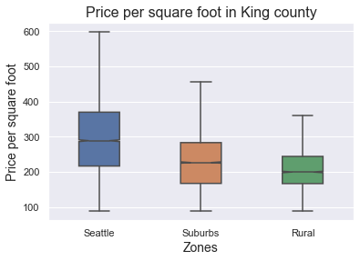
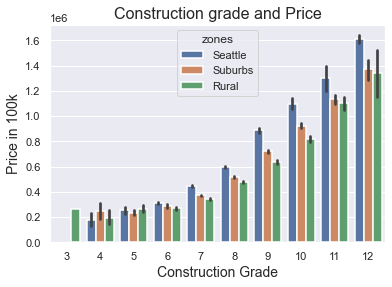
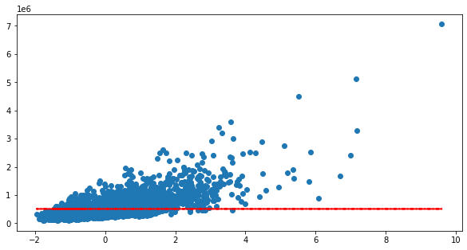
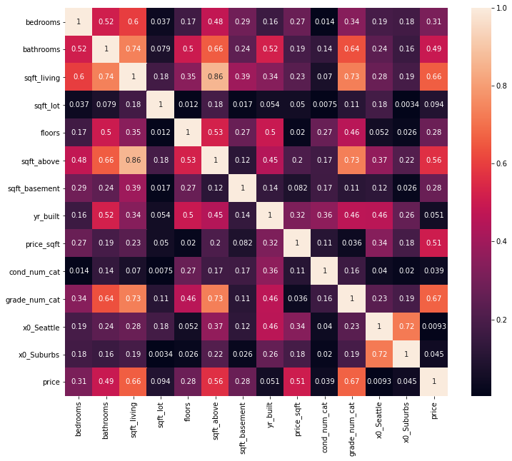
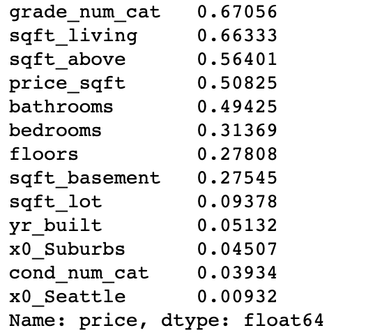
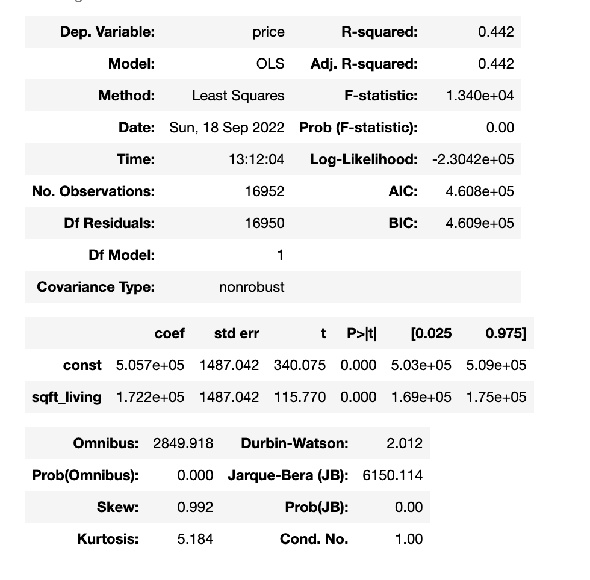
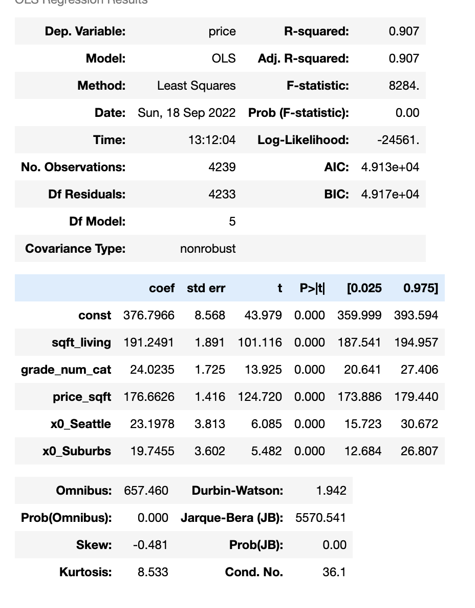

# King County Housing 
This repository was created to enable exploratory data analysis and create linear regression models from the King County, WA property sold in 2014 through 2015. NW Homes, local real estate agency, wants unique insights for accurately pricing their clients' homes to avoid the homes sitting on the market for too long.

Phase 2 Project Igloo Analytics – King County Realty

Juana Tavera, Clay Hunn, and Brendan Bruno

# Overview & Main Findings
The team's exploratory analysis and linear regression models discovered a few recommendations for NW Homes. When selling homes in the King County area, NW Homes wants to focus on square feet living space, the construction grade of the home, the location of the home, and the price per square foot to best price the home.

## Business Understanding & Problem
The business problem at hand is that NW Homes (our stakeholder - local real estate agency) is looking for unique insights in the King County, WA property market so they can best price their clients' homes in order to avoid the property sitting on the market for too long. They tasked the team with exploring and modeling what features of a home are most significant to the price of a home. Therefore Igloo Analytics' goal was to analyze the key factors in the price of homes in the King County area and how strong the relationship was between them. 

## Data Analysis - Intital Setup
The dataset kc_house_data.csv was used for data analysis and modeling.

kc_house_data.csv has 21 columns and ~22,000 entries. As the team explored these entries, it was realized that not all columns were needed for our business problem, so ended up dropping seven of them:

- lat
- long
- view
- sqft_living15
- sqft_lot15
- yr_renovated
- waterfront

We used the remaining columns relevant to our stakeholder to do further data analysis and the modeling. 

That being said, there are a few limitations that this dataset has. The first is the depth of information. For example, there is no columns containing the vicinity to community spaces, tourist attractions, parks, etc. which can have a significant impact on the price of the home. As well there is no address column where we would be able to look at the neighborhood of the home to determine the impact it would have on price. 

## The Notebooks
Each team member created a separate branch to help facilitate data analysis and modeling without creating any issues to the original data set. The branches were labeled with the team members name. Inside those branches similar naming schemes were used to identifiy what part of the project the file was for. The main files are the "eda" for exploratory data analysis, "regression" for training and testing models, and "main" for the final notebook which contains the final findings and vizualizations. 

# Results

## king_main 

The first major section of the king_main.ipynb includes the dropping of unnecessary columns and the creation of columns needed for our stakeholder. 

The columns that were created were price_sqft which is price per square foot column and  dropping the outliers in the price column. Also created multiple maps to apply to different columns such as the zip map, grade map, and condition map which would help with modeling later on. The zipcode map binned all the zipcodes into rural, suburbs, and Seattle, and for the condition and grade maps where mapped to integers so they could be used for linear regression. 

Comparing the price per square foor in each zone - Rural, Suburbs, and Seattle - that was created by binning zipcodes.

Showing price differences in grade catagory across the different zones we created.

We train/test split the dataset so it could be used for our modeling. Also used Ordinal Encoder on the grade and condtion columns since they are ordered by how well the homes is made/maintained. And used One Hot Encoder for zones to avoid multicollinearity. We then standard scaled our train and test dataframes so one coefficient would not skew the data because of the scale of it. 

## Dummy Model

Our Dummy Model was just using the mean of our target variable price to predict the price of a home. The score of the baseline model was 0.00 and the root mean squared error was $260,998, which is not very good therefore we can improve. 

To see which features we should include in our modeling, as well as based on our stakeholder problem, we decided to create a correlation heatmap of the columns. 

## Simple Linear & First Model 
Our first model was of square foot living because although its correlation was below grade, we believed it to be more relevant for our stakeholders

As you can see our adjusted R^2 value is equal to 0.442 which means that square foot living accounts for 44% variation of our target variable price. Which is a lot better than zero but we can improve. Also our test score for this simple model was 0.45 and the root mean squared error was ~$265,000 which is not very good at predicting the price of a home. 

## Multi Linear & Final Model
After running a few regression models, we determined that the zone house grade, square foot living, and price per square foot were some of the largest contributing factors and could better help determine whether a house was over or under priced based on the zone and grade of the house.

As you can see our adjusted R^2 value is equal to 0.907 which means that square foot living accounts for 91% variation of our target variable price. Which is a significanlty better than our first simple model. Also our test score for this final model was 0.85 and the root mean squared error was ~$80,000 which is a significant improvement from the first model. 

# Conclusion

In conclusion we would recommend sellers to look into the area they are selling their home, the construction grade of their home and if they can increase that grade, and finally the square footage of the house.

Generally speaking sellers can expect for every 840 square feet increase you can expect about a 195k increase in price

For every increase in construction grade you should expect about a 23k increase in price

We got these numbers by comparing STD in our df and then comparing that to the Coef of our final model 